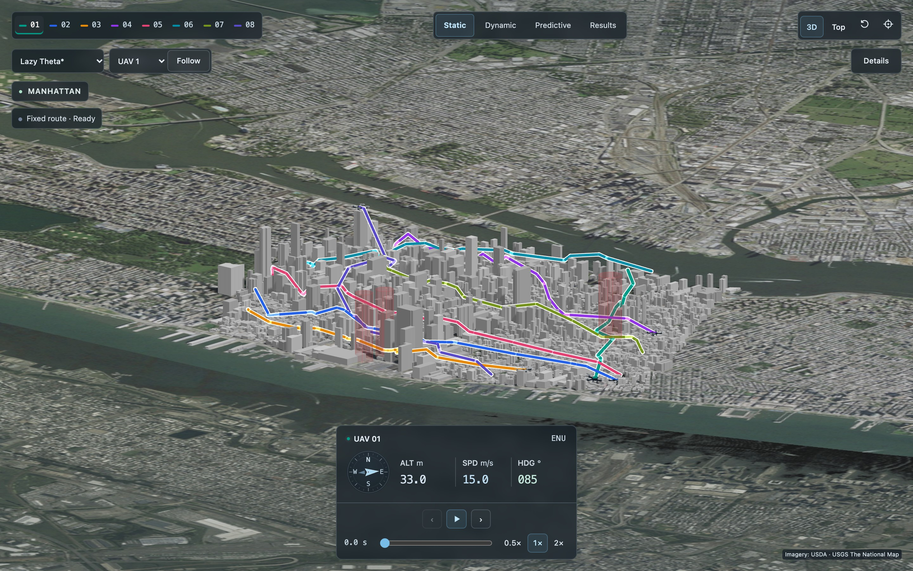

# UAV 3D Planner

[](https://github.com/Revincxt/uav-3d-planner/actions/workflows/ci.yml)
[](https://github.com/Revincxt/uav-3d-planner/actions/workflows/pages.yml)
[](https://github.com/Revincxt/uav-3d-planner/releases/latest)
[](https://www.python.org/)
[](https://nodejs.org/)
[](https://pnpm.io/installation)
[](LICENSE)

A 3D UAV path-planning simulator built on real Manhattan building data, featuring static routing, reactive replanning, and predictive space-time planning.

[Live Demo](https://revincxt.github.io/uav-3d-planner/) · [Quick Start](#quick-start) · [References](#references)



## Features

- **Static**: Compare A*, Lazy Theta*, and RRT* routes around fixed obstacles.
- **Dynamic**: Replay reactive obstacle avoidance and local replanning around shared moving obstacles and temporary no-fly zones.
- **Predictive**: Use known traffic schedules for 4D space-time planning, avoiding future conflicts and restricted time windows.
- **Results**: Compare three aggregate metrics per study using bar charts.

Explore a 3.6 × 3.8 km city model with 8 missions per study and 6–8 mandatory waypoints per route. Includes smooth trajectories, variable-speed playback, close-range drone following, and mission details.

Planning and validation run offline in Python; the browser replays precomputed results. Missions and traffic are simulated, not approved for real-world flight. Joint collision avoidance between mission UAVs is not implemented.

## Quick Start

Requires Node.js 24+ and pnpm 11.9. From the repository root:

```bash
cd web
pnpm install --frozen-lockfile
pnpm dev
```

Open [http://localhost:5173](http://localhost:5173). Precomputed results are restored automatically from verified lossless archives; no Python installation or route recomputation is needed. Online aerial imagery requires internet access, with a road-map fallback when offline.

## References

1. Hart, P. E., Nilsson, N. J., & Raphael, B. (1968). [A Formal Basis for the Heuristic Determination of Minimum Cost Paths](https://doi.org/10.1109/TSSC.1968.300136). *IEEE Transactions on Systems Science and Cybernetics*, 4(2), 100–107.
2. Nash, A., Koenig, S., & Tovey, C. (2010). [Lazy Theta*: Any-Angle Path Planning and Path Length Analysis in 3D](https://ojs.aaai.org/index.php/AAAI/article/view/7566). *AAAI*, 147–154.
3. Karaman, S., & Frazzoli, E. (2011). [Sampling-based Algorithms for Optimal Motion Planning](https://arxiv.org/abs/1105.1186). *The International Journal of Robotics Research*, 30(7), 846–894.
4. Koenig, S., & Likhachev, M. (2002). [D* Lite](https://publications.ri.cmu.edu/d-lite). *AAAI*, 476–483.
5. Silver, D. (2005). [Cooperative Pathfinding](https://ojs.aaai.org/index.php/AIIDE/article/view/18726). *AIIDE*, 117–122. Background on space-time search.

Data sources: [NYC Open Data · BUILDING](https://data.cityofnewyork.us/City-Government/BUILDING/5zhs-2jue) · [USGS NAIP Plus aerial imagery](https://imagery.nationalmap.gov/arcgis/rest/services/USGSNAIPPlus/ImageServer).

[MIT License](LICENSE) · [Revincxt/uav-3d-planner](https://github.com/Revincxt/uav-3d-planner)
