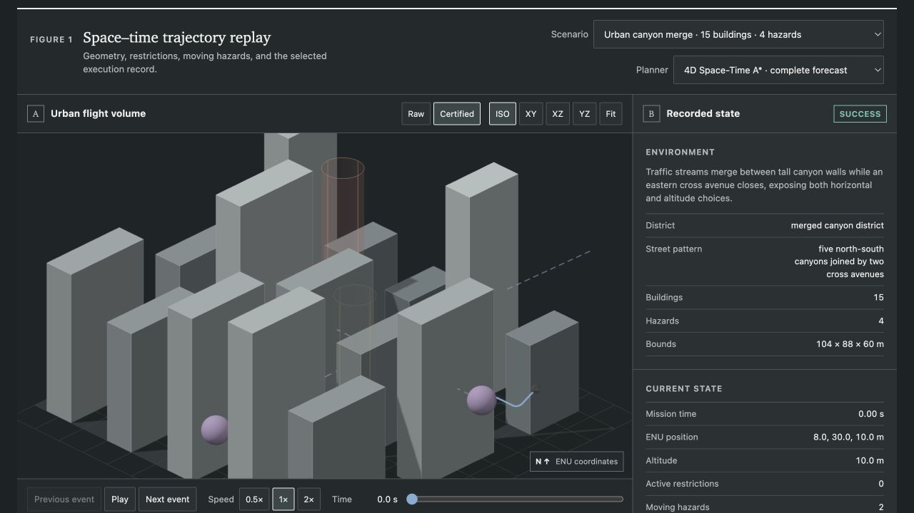
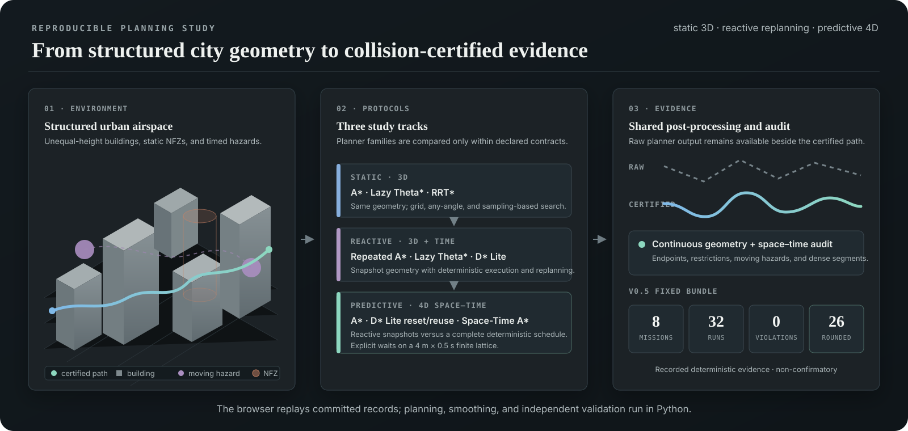

<div align="center">

# UAV 3D Planner Lab

**Reproducible 3D planning and space–time replanning in structured urban airspace**

[](https://github.com/Revincxt/uav-3d-planner/actions/workflows/ci.yml)
[](https://github.com/Revincxt/uav-3d-planner/actions/workflows/pages.yml)
[](https://github.com/Revincxt/uav-3d-planner/releases/latest)
[](https://www.python.org/)
[](LICENSE)

[**Open the live study**](https://revincxt.github.io/uav-3d-planner/predictive.html) ·
[Reproduce a run](#quick-start) ·
[Read the methodology](docs/methodology.md) ·
[Latest release](https://github.com/Revincxt/uav-3d-planner/releases/latest)

</div>

<a href="https://revincxt.github.io/uav-3d-planner/predictive.html">
  
</a>

<p align="center"><sub><strong>Representative v0.6 baseline case.</strong> Urban canyon merge · 15 buildings · 4 hazards · 4D Space-Time A*.</sub></p>

UAV 3D Planner Lab is an experiment-first Python benchmark for studying how grid, any-angle,
sampling-based, incremental, and space–time planners behave in the same declared urban geometry.
Planner output, downstream geometry processing, optional execution-candidate retiming, continuous
collision auditing, and browser presentation remain separate so that each result can be inspected
and reproduced without attributing downstream changes to the planner.

The Python package has no runtime dependencies. The web application does not run a planner or
smoother: it replays committed records that Python regenerates and independently validates.

## What the lab studies

| Study track | Research question | Planner conditions | Explore |
| --- | --- | --- | --- |
| **Static 3D** | How do graph, any-angle, and sampling-based methods differ when geometry and safety margin are fixed? | 3D A* · Lazy Theta* · RRT* | [Paths](https://revincxt.github.io/uav-3d-planner/) · [Results](https://revincxt.github.io/uav-3d-planner/results.html) |
| **Reactive dynamic** | How do cold-start and state-reusing replanners respond to the same deterministic obstacle schedule? | Repeated 3D A* · Repeated Lazy Theta* · 3D D* Lite | [Replay](https://revincxt.github.io/uav-3d-planner/dynamic.html) |
| **Predictive 4D** | What changes when snapshot-only conditions are compared with access to a complete deterministic schedule, and which post-processed paths meet a frozen discrete execution envelope? | Repeated 3D A* · D* Lite reset/reuse · 4D Space-Time A* | [Study](https://revincxt.github.io/uav-3d-planner/predictive.html) |



<p align="center"><sub>Study design. Planner families are compared within explicit information, discretization, execution, and work-budget contracts.</sub></p>

## Recorded evidence in v0.7

| Scope | Recorded result |
| --- | ---: |
| Curated deterministic missions | **10** — 1 calibration case + 9 complex city cases |
| Planner conditions per mission | **4** |
| Successful raw planner records | **40 / 40** |
| Runs accepting sampled circular-fillet rounding | **34 / 40** |
| Collision-certified geometry candidates | **40 / 40** |
| Discrete-envelope-qualified execution candidates | **5 / 40** |
| Rejected by the frozen 90 s execution limit | **34 / 40** |
| Rejected by the post-retiming dynamic collision audit | **1 / 40** |
| Raw / geometry closest-approach witnesses | **40 / 40** in each domain |

Seven non-calibration maps contain 14–16 unequal-height buildings; the new `braided-skyway` and
`harbor-switchback` diagnostics each contain 20. Every complex case has at least one static no-fly
zone and two time-dependent hazards, while the two extended cases each carry four. The raw timed
path is retained for every run. Rounding is a common downstream operation—not a property attributed
to any planner—and falls back to the certified raw polyline if a candidate fails the audit. The
five qualified execution candidates comprise one repeated-A*, one reset-D*, one reuse-D*, and two
Space-Time-A* records; these are descriptive counts within ten paired scenarios, not an algorithm
ranking.

> Qualification is deliberately fail-closed and uses thresholds frozen before regeneration. The
> 5/40 count is an observed result, not a release gate. It is not a general safety claim, continuous-
> dynamics guarantee, or flight certification. The v0.6 records remain a paired historical
> baseline and are not pooled with v0.7 as independent observations.

## Frozen v0.7 study contract

Version 0.7 reuses the unchanged v0.6 matrix: **10 scenarios × 4 planner conditions = 40 paired
runs**. The scenario is the independent unit (`n = 10`); planner-condition rows, playback frames,
waits, and replanning epochs are not independent samples. The protocol is
`predictive-space-time-v4`, the public bundle is schema version `3`, and the dataset identifier is
`predictive-execution-envelope-v0.7`.

Every run keeps three evidence layers distinct:

1. `rawTimedPath` and `plannerMetrics`: planner or online-policy output and metrics computed only
   from that raw path;
2. `geometryTimedPath` and `geometryMetrics`: common geometric rounding under the original timing;
3. optional `executionTimedPath` and `executionMetrics`: a deterministically retimed geometry
   candidate that is present only when it qualifies.

The execution envelope freezes maximum segment-average speed at `8 m/s`, maximum absolute climb or
descent rate at `3 m/s`, a boundary-aware acceleration proxy at `4 m/s²`, a `150°` reversal
threshold with no non-zero-speed reversals allowed, and a `90 s` arrival limit. Retiming may only
increase movement-segment durations, preserves wait durations, and is followed by a new continuous
space–time collision audit because obstacle positions may change with the delayed timestamps.

Qualification remains a waypoint-level, discrete-envelope result. It is not continuous-dynamics
certification, aircraft flight certification, or evidence about attitude, thrust, curvature, jerk,
wind, energy, or actuators. Thresholds are fixed before regeneration; the number of qualified
execution candidates is an observed outcome, not a release gate or a target used for tuning. See
the [v0.7 execution-envelope experiment plan](docs/v0.7-execution-envelope-plan.md).

## Algorithm map

| Track | Search / information model | Methods |
| --- | --- | --- |
| Static | 26-connected voxel graph or bounded continuous 3D space | 3D A* · Lazy Theta* · seeded RRT* |
| Dynamic | Current conservative snapshot with deterministic execution gating | Repeated 3D A* · Repeated Lazy Theta* · state-reusing 3D D* Lite |
| Predictive | Three snapshot conditions plus one complete-schedule condition | Repeated 3D A* · 3D D* Lite (reset) · 3D D* Lite (state reuse) · 4D Space-Time A* |

Space-Time A* is earliest-arrival on a declared `4 m × 0.5 s` finite lattice with explicit waits;
it is not a claim of continuous state–time optimality. Expanded spatial nodes, D* Lite queue pops,
and expanded space–time states remain algorithm-specific work indicators and are not normalized
into a single compute metric.

## Quick start

```bash
python3 -m venv .venv
source .venv/bin/activate
python -m pip install -e .
uav3d scene list
uav3d predictive plan --scenario urban-canyon-merge --algorithm space-time-astar-4d
```

Export the complete recorded predictive study:

```bash
uav3d export-predictive \
  --output-dir artifacts/predictive-study \
  --source-commit "$(git rev-parse HEAD)"
```

Run the academic web views locally:

```bash
cd web
pnpm install --frozen-lockfile
pnpm test && pnpm build && pnpm dev
```

Static benchmark, dynamic simulation, sensitivity, timing, and dataset-generation protocols are
documented in the CLI help and [methodology](docs/methodology.md).

## Reproducibility and validation

Every exported record carries its semantic problem fingerprint, source commit, work limit and
usage, termination reason, raw planner evidence, separate geometry and execution outcomes, and a
stable run ID. Release validation resolves the recorded source revision, recomputes downloadable-
artifact digests, and checks configuration, timing, sample-count, summary, and geometry identities.

```bash
python -m pip install -e '.[dev]'
ruff check . && ruff format --check .
mypy src
pytest --cov=uav3d --cov-report=term-missing
python scripts/export_scenarios.py --check
python scripts/validate_committed_data.py
cd web && pnpm validate:data && pnpm test && pnpm typecheck && pnpm build
```

The geometry audit uses continuous segment tests for axis-aligned boxes and finite vertical
cylinders. Dynamic validation adds exact relative-motion checks for moving spheres, scheduled
restrictions, endpoint connectors, explicit waits, and every dense linear space–time segment.
Closest-approach witnesses and waypoint-level kinematic values are descriptive diagnostics. Passing
the frozen discrete execution envelope does not expand a piecewise-linear collision audit into a
continuous vehicle-dynamics or flight certificate.

## Project guide

| Resource | Contents |
| --- | --- |
| [Methodology](docs/methodology.md) | Assumptions, experiment contracts, estimands, collision model, and comparison limits |
| [Data schema](docs/data-schema.md) | Static, dynamic, and predictive record formats |
| [v0.5 study plan](docs/v0.5-demo-plan.md) | Scenario contracts, smoothing policy, and release acceptance criteria |
| [v0.6 model/UI plan](docs/v0.6-model-ui-plan.md) | Extended-city cases, diagnostic metrics, UI scope, and acceptance gates |
| [v0.7 execution-envelope plan](docs/v0.7-execution-envelope-plan.md) | Frozen matrix, three-layer evidence contract, discrete envelope, and acceptance gates |
| [Roadmap](docs/roadmap.md) | Planned research extensions and explicit non-goals |
| [Changelog](CHANGELOG.md) | Version-by-version changes |
| [Citation metadata](CITATION.cff) | Repository citation information |

Core code lives in `src/uav3d/`; committed scenes and schemas live in `scenarios/`; validation and
behavioral tests live in `tests/`; the four recorded study views live in `web/`.

## Current limits

- The vehicle is spherical and follows a dense piecewise-linear path; v0.7 qualification applies
  only to its declared segment-average execution envelope.
- Speed, boundary-aware acceleration-proxy, climb-rate, reversal, and mission-time qualification is
  discrete. The model does not certify attitude, continuous acceleration, turn rate, curvature,
  jerk, minimum-snap dynamics, wind, energy use, sensing uncertainty, or forecast uncertainty.
- Predictive experiments use a known deterministic schedule; the Pages application is recorded
  continuous-time playback, not a real-time planner.
- The v0.7 cohort reuses the v0.6 scenarios and planner conditions as a paired extension. Releases
  must not be pooled as independent cohorts, and the 40 within-release rows remain clustered in ten
  scenarios.
- The project is a planning research benchmark, not a flight controller, regulatory-compliance
  tool, or operational safety system.

## References

- Hart, Nilsson, and Raphael. “A Formal Basis for the Heuristic Determination of Minimum Cost Paths.” *IEEE Transactions on Systems Science and Cybernetics*, 1968.
- Nash, Koenig, and Tovey. “Lazy Theta*: Any-Angle Path Planning and Path Length Analysis in 3D.” *AAAI*, 2010.
- Karaman and Frazzoli. “Sampling-based Algorithms for Optimal Motion Planning.” *International Journal of Robotics Research*, 2011.
- Koenig and Likhachev. “D* Lite.” *AAAI*, 2002.

## Citation and license

Citation metadata is provided in [CITATION.cff](CITATION.cff). Source code is released under the
[MIT License](LICENSE).
